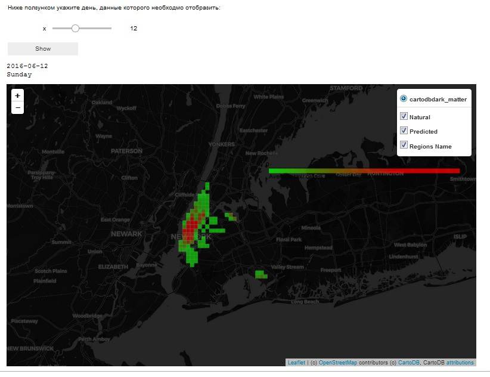
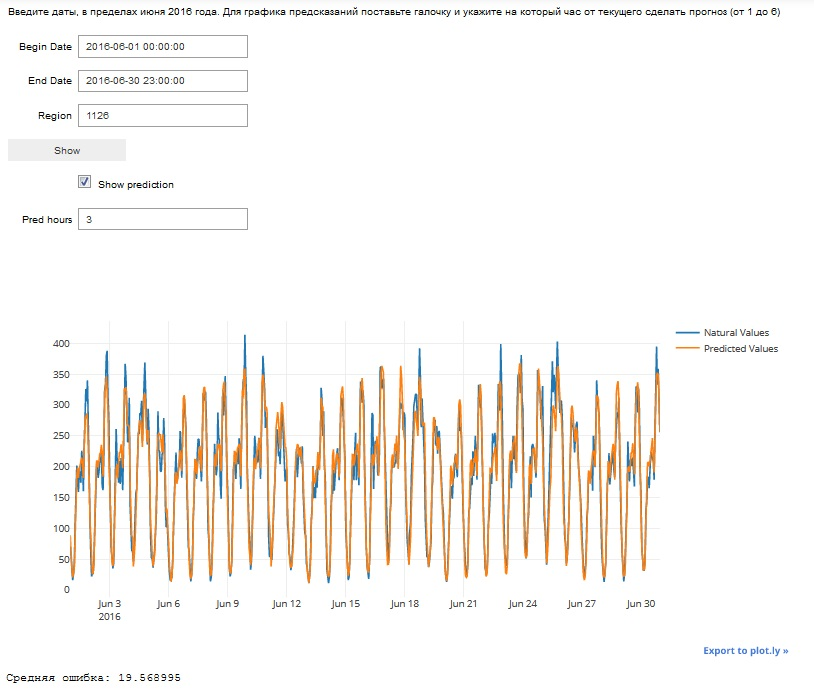
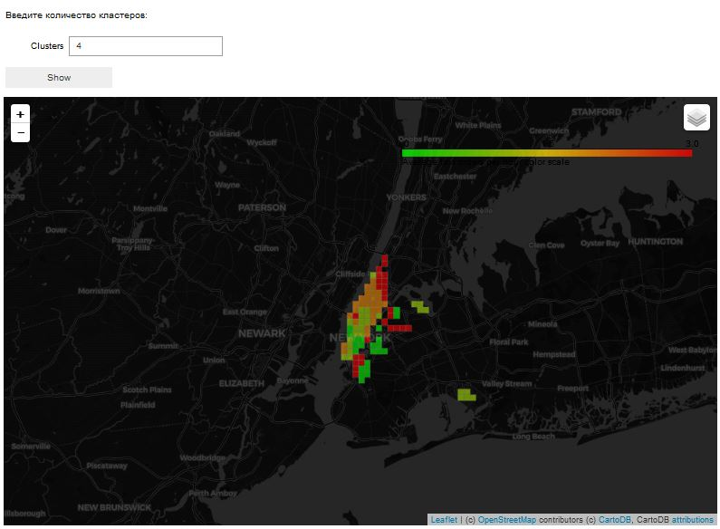

# Taxi_prediction_python
Проект по Нью-Йоркскому такси.  Основной файл для запуска - NYC_Taxi_Presentation.ipynb. Если у вас по каким-то причинам не загружается проект, можно посмотреть офлайн версию NYC_Taxi_Presentation_offline.html  со скринами imgs
<br>

UPD: Решил для удобства его выложить здесь.
<br>
<br>

# Прогнозирование поездок желтого такси Нью-Йорка
Перед вами презентация проекта, представляющего собой прогнозирование временного ряда, а именно количества поездок желтого такси в Нью-Йорке.
<br>
Данные о поездках были взяты из открытого источника - официального сайта города Нью-Йорка.
<br>
http://www.nyc.gov
<br>
<br>
В ходе работы был проведен тщательный анализ данных, выявлены и сгенерированы наиболее важные признаки.
<br>
Предсказываемый признак - **количество поездок из определенного района города**. В связи с этим, на основании геоданных, откуда был совершен заказ, Нью-Йорк был разделен на 2500 районов. Из них наибольший интерес представляют всего 102 - у них среднее количество поездок в час больше 5.
<br>
Основными предсказывающими признаками явлются:
* гармонические колебания с разными периодами
* признаки дат: время суток, идентификатор начала/конца месяца, время года
* официальные праздники
* данные за предыдущий час, два часа, сутки... 
* сумма поездок за предыдущий день, два дня..
* доля поездок в этот район в предыдущий час, два...
<br>

В качестве регрессионной модели был использован алгоритм **Градиентного бустинга** с оптимально подобранными параметрами.
<br>
Обучающий период был взят равный одному году - с июня 2015 по май 2016. При этом, для тестирования качества модели был выбран май 2016.
<br>
Модель создавалась под *каждый* район Нью-Йорка в отдельности
<br>
<br>
Данная презентация основана на предсказании **июня 2016 года**. Поэтому все временные рамки ограничены этим временем.
<br>
<br>
Функция, вычисляющая среднюю ошибку модели для июня 2016:
<br>
<br>


<br>

Для ее вычисления, делаются предсказания от каждого часа начиная с *2016.05.31, 23:00* на 6 подряд идущих вперед часов. Эта формула использовалась для вычисления результатов соревнования на kaggle: https://www.kaggle.com/c/yellowtaxi
<br>
Текущая презентация разделена на 2 части: интерфейсная (в которой вы сейчас находитесь) и бэкэнд (main_backend.py), в котором производится загрузка необходимых данных и их обработка.
<br>
Разработка велась на Python 2.7. Для корректной работы, помимо стандартных, необходимо, чтобы были установленны библиотеки **folium, plotly, IPython, ipywidgets, geojson, branca** и обеспечено подключение к интернету.
### Запуск backend
Загрузка исполнительной части. Занимает порядка 10 сек.
```
%run main_backend.py
(wid_ShowMap,
 wid_ShowPlot,
 wid_ShowMap_clust) = main_proc()
```
 ### Отображение данных на карте
 Здесь вы можете видеть карту, на которой цветом обозначено количество поездок из каждого района в определенный день.
<br>
У карты 3 слоя:
* 'Natural' - оригинальные данные за июнь 2016
* 'Predicted' - предсказанные данные
* 'Regions_name' - номер региона на карте
<br>
<br>

Для начала выберете день месяца, который вы хотите отобразить на карте, после чего нажмите на "Show"
<br>
<br>
Включение и отключение слоев производится нажатием на соответсвтующую пиктограмму в правом верхнем углу карты.
<br>
<br>
Чтобы узнать номер района, просто щелкните по нему мышью на карте.
```
wid_ShowMap()
```

<br>

Что можно сказать по текущей карте? Максимум, что можно уверенно заявить, что реальные и предсказанные данные очень похожи. Они практически не отличимы по цвету, так как ошибка предсказания небольшая и цветовая шкала не позволяет отследить эти изменения.
<br>
<br>
### График количества поездок
Для того, чтобы исправить эту ситуацию и получить более детальные данные, посторим графики.
<br>
<br>
Укажите даты в пределах июня 2016, а также исследуемый район. Номер района можно узнать по карте выше. 
<br>
Если наряду с реальными данными вы хотите видеть прогнозируемые моделью, то поставьте галочку в поле "Show prediction" и укажите, на который час от текущего делать прогноз. Чем больше час, тем, соответственно, меньше точность.
<br>
<br>
Ошибку предсказаний можно увидеть ниже после графика:
```
wid_ShowPlot()
```



### Кластеризация
Для наглядного представления, насколько похожи районы города по поведению, проведем кластеризацию. Кластеризация проводится алгоритмом **K-Means**
Для этого, введите количество кластеров, необходимых для анализа.
<br>
Можно заметить, например, что поведение количества заказов у аэропортов практически всегда одинаково, при небольших кластерных разделениях.
<br>

```
wid_ShowMap_clust()
```
<br>


<br>
<br>

## Summary
В ходе данного задания была проделана большая работа по анализу временных рядов. Разумеется, была проанализироана и модель ARIMA, которая не показала свое превосходство. Качество было хуже, кроме того, ее обучение происходило довольно длительное время даже на небольших данных. 
<br>
<br>
По результатам многих тестов, лучшей моделью стал Градиентныей бустинг.
<br>
Для этой регрессионной модели был взят временной период, равный одному году. Я считаю, что для такого относительно небольшого временного интервала качество модели получилось более чем удовлетворительное. **16.004 - средняя ошибка** для 6 первых часов прогноза по результатам kaggle-соревнования. Ник: *krelembra*. Ссылка на лидерборд: https://www.kaggle.com/c/yellowtaxi/leaderboard
<br>
<br>
Считаю, что это не предел качества и модель можно значимо улучшить, взяв в рассмотрение больший период времени. Помимо самих по себе новых данных, станет возможна генерация новых признаков, таких как полугодовые и годовые периоды.
